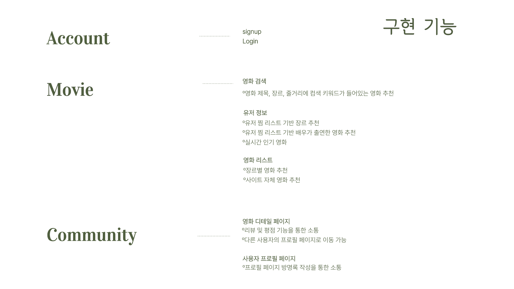
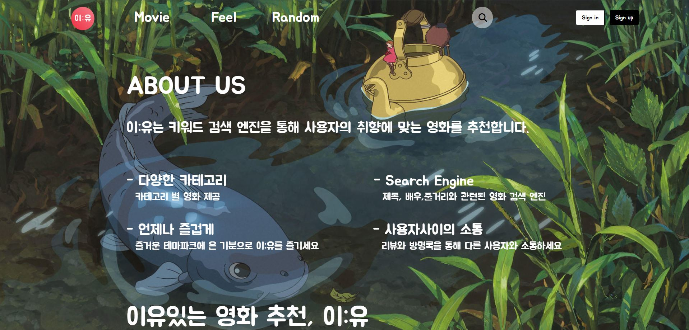
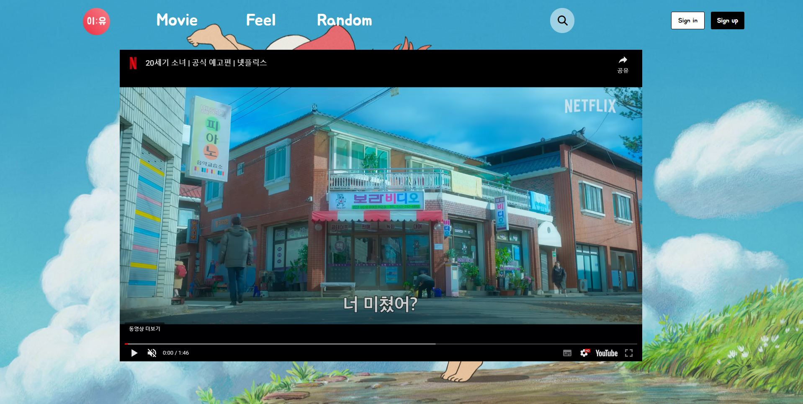
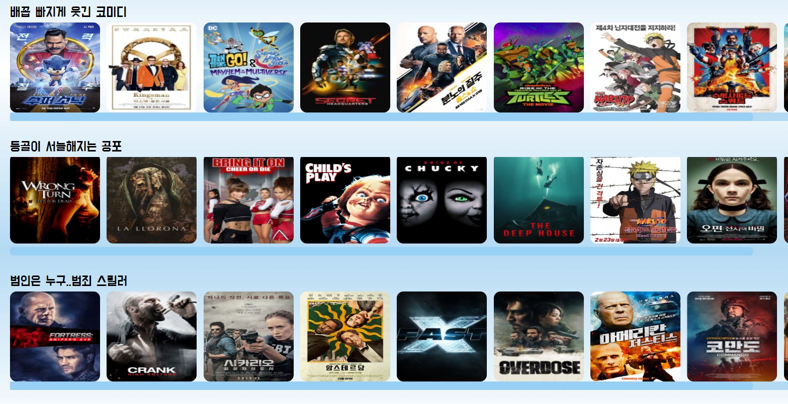
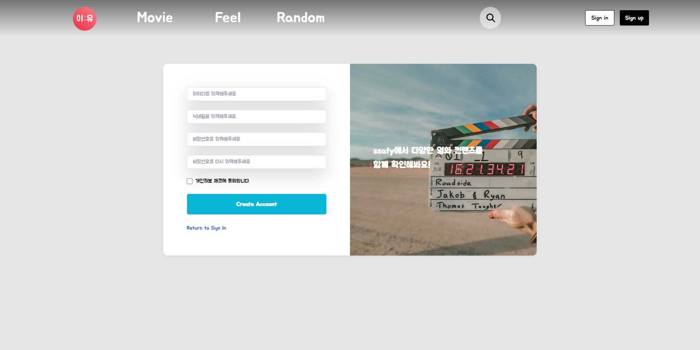
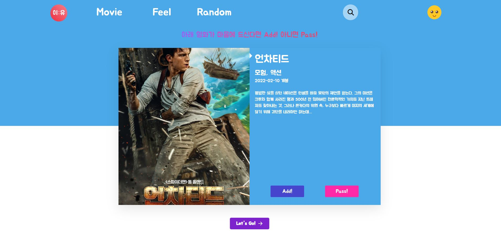
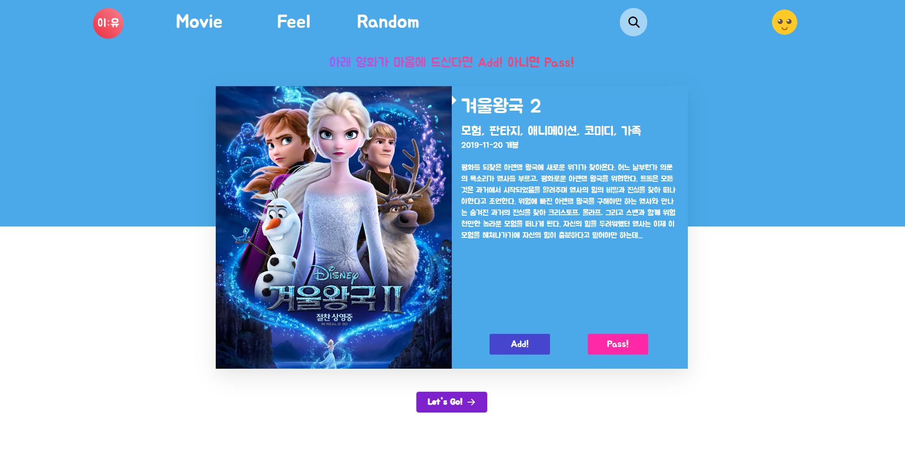
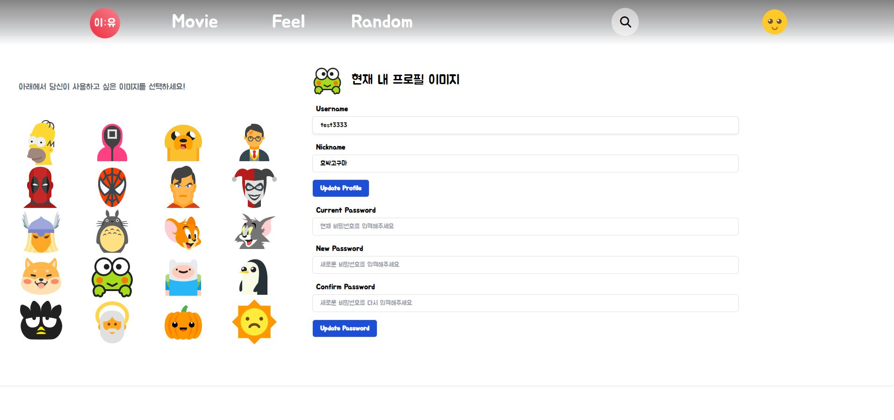
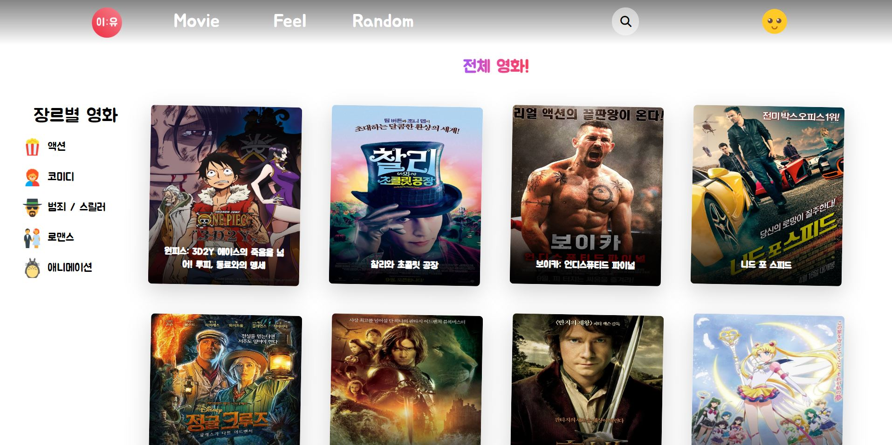
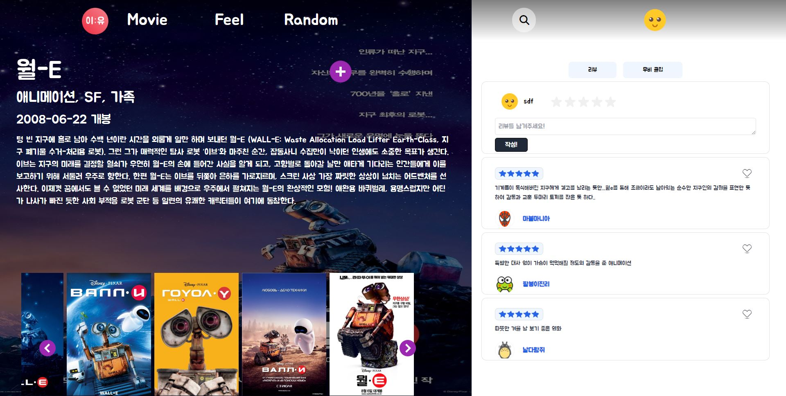

# 이:유

`이유있는 영화 추천 이:유`

[프로젝트 메모 및 공유 : Notion](https://rose-mushroom-2f9.notion.site/1791c848606e4b30a543c6bc34284f95)

# 1. 프로젝트 개요 및 팀원 업무 분담 내역

## 📂 개발 기간: 2022.11.16 ~ 2022.11.25 (총 9일)

## 🎮 개발 도구 
- Python
  - Python 3
  - Django 3.2.12
  - Django REST framework
- HTML, CSS, JavaScript
  - Bootstrap 5
  - Tailwind 3
- Vue 2
  - Vuex
  - Vue Router

## 팀원 소개 

😎 류원창
  - BE : 유저 관련
  - FE : 렌더링, 장르별 영화, 회원가입 및 회원 정보 수정 페이지 구현

😁 이지은
  - BE : 영화, 댓글 관련
  - FE : 메인, 영화 디테일, 위시 리스트, 유저 프로필 페이지 구현

🎈공통
-  BE : Django API Server. 영화 API를 활용한 Data Seeding
  

# 2. 구현 기능 및 알고리즘

# 3. 데이터 베이스 모델링 (ERD)

[ERD 보러가기](https://app.quickdatabasediagrams.com/#/d/7lRpZ6)

# 4. 페이지와 기능 설명
## 렌더링 페이지

- 첫 렌더링 페이지
- 서비스 소개 글과 영화 장르별 이미지를 섹션으로 나누어
- 스크롤 시 다음 섹션으로 이동하는 스크롤 이벤트

&nbsp;

## Home 페이지

- 배경으로 영호 티저 재생
- 실시간 인기 영화는 현재 서비스에서 유저들이 가장 많이 누른 영화로 갱신
- 그 외에 장르별 영화들이 카드 형태로 나열

- 네브바 마우스 오버 변화

&nbsp;

## 회원가입 페이지

&nbsp;

## 회원가입 후 영화 위시리스트 담는 페이지

- 랜덤의 영화를 위시리스트에 넣거나 pass할 수 있는 페이지
- Add버튼을 누르면 위시리스트에 담기고 Pass버튼을 누르면 다른 영화 정보가 렌더링
&nbsp;

## 회원 정보 수정 페이지

- 내 프로필 사진 선택해서 변경
- 닉네임, 비밀번호 변경 가능

&nbsp;

## Movie 페이지

- 왼쪽의 메뉴를 통해 장르별 영화를 보여주는 페이지로 이동 가능
- 페이지 접속 시 적절한 갯수의 영화 정보를 렌더링 시키고, 무한스크롤을 통한 영화 정보 카드 추가

&nbsp;

## 영화 디테일 페이지

- 영화의 디테일과 리뷰 작성, 무비 클립이 렌더링 (컴포넌트 변경)
- 여기서 다른 회원의 프로필 페이지로 이동 가능

&nbsp;

